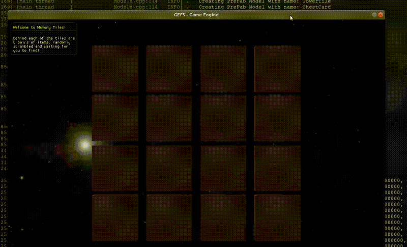
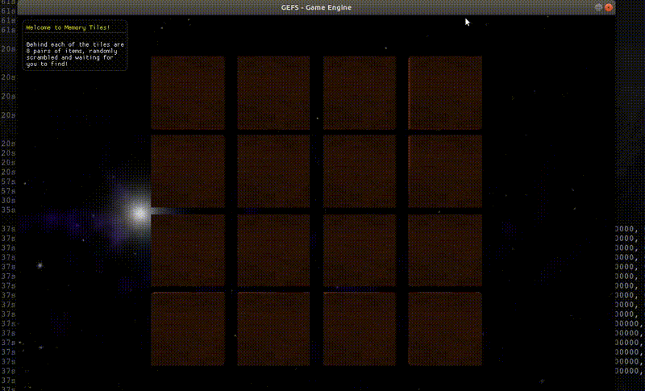
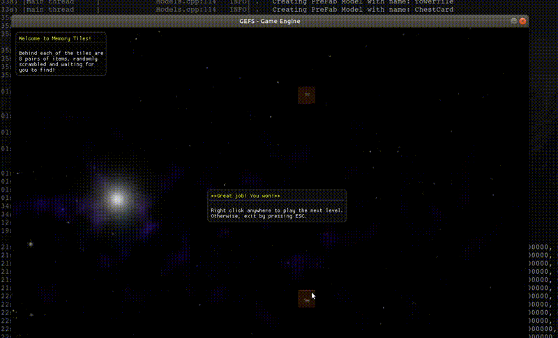

# 8980-scripted-game [Memory Tiles]
CSCI 8980 - Real-time Game Engine Design, Assignment 3
- Nikki Kyllonen, [nkyllonen](https://github.com/nkyllonen)

- Emily Moeller, [ecmoeller](https://github.com/ecmoeller)

## Building and Running Instructions
```
# build Makefile using cmake (need to do this for every additional C++ files added)
$ cd build
$ cmake ..

# build engine
$ cd GEFS
$ make -C <location of build/>

# to run a scene
$ cd GEFS
$ ./engine <folder containing main.lua> <optional config string>
```

Optional config strings are shown in `settings.cfg` as `[config string name]`. An option includes `[Debug]` which would then be run as follows:
```
$ ./engine <folder containing main.lua> Debug
```

## Resources
- Low poly tree obj package: [TurboSquid link](https://www.turbosquid.com/3d-models/blender-carrot-crystal-oak-tree-3d-model-1189852)

- Pirate Kit (1.1): Created/distributed by Kenney [(www.kenney.nl)](www.kenney.nl)

- Farm Animals Pack by Quaternius [https://www.patreon.com/quaternius](https://www.patreon.com/quaternius)

- Pirate Pack

- Potion Pack

- Farm Animals Pack by Quaternius [https://www.patreon.com/quaternius](https://www.patreon.com/quaternius)

- Nebula Skybox: Created by 'amethyst7' aka Chris Matz. WEB site: [http://amethyst7.gotdoofed.com](http://amethyst7.gotdoofed.com)

## Controls
- Arrow keys are scene dependent
    - If running `SimpleExample/`, these translate the trex model along the tiled floor.
    - If running a scene with the dynamic camera, such as `Problem1/` or `DebugCamera/` or `FrustumCulling/`, these rotate and translate the camera.
- R-key
    - Resets the scene by reloading the materials, models, and scene files. These do not include any changes made that require recompilation.
    - Note that this feature does not always work.
- D-key
    - Switches between viewing from the debug camera and viewing from the main camera. The debug camera position can be manually set in settings.cfg and used if a scene is initially launched in Debug mode (e.g. ./engine Problem1/ Debug).
- F-key
    - Switches between fullscreen viewing and window viewing.
    - Note that some screen recording programs will not record the fullscreen window that is displayed upon the screen.
- S-key
    - Will take a screenshot of the current window (without the text box displaying the fps and other measurements) and save it to a Screenshots folder within GEFS.

## Project Report

### Final Submission Video

[](https://drive.google.com/file/d/17fKi_CLu9FM_aSlv4TGW93ss_OIPm4TW/view?usp=sharing)

_This is a 2x sped up gif showing off our full Memory Tiles game. Click gif to go to a 1.5x sped up Google Drive video of our gameplay._

Run **Memory Tiles** as such, with the `Game` configuration setting:

```
$ ./engine MemoryGame/ Game
```

### Animation Highlights

_show a targeted video highlighting the use of animation. Explain why you chose these specific animation aspects for your puzzle/game (from a design perspective) and describe how you achieved these animation effects (from a technical perspective)_

#### Rotating tiles by clicking

[](https://drive.google.com/file/d/1VmDnugBzUmzohaOUJID3_5jrK3Es1-q2/view?usp=sharing)

_Click gif to go to the video._

1. From a design perspective, why did we choose a click-based rotation?

    A click-based rotation is the closest to how you would naturally play this game with cards on a table. In a physical card matching game, you would pick up and flip cards manually. By allowing the player to click on which tile they would like to turn and then animating that "flip" as a quick rotation, we can most closely emulate the action of flipping up a card.

2. From a technical perspective, how did we implement a click-based rotation?

    The rotation is done by keeping track of the amounts that each tile is currently rotated. These values are stored as radian values within the `flipped` array:
    
     ```
        0 : this tile is not rotating at all (therefore must be either flipped up or down)
        < 0 : this tile is in the middle of flipping down
        > 0 : this tile is in the middle of flipping up
    ```
    
    Each frame, these values are monitored and the tiles with non-zero values are further rotated in their respective directions by calling `rotateModel` and updating their radian value within `flipped`.

    The clicking is done by creating a layer of colliders on top of each tile. These colliders are placed when the board is originally generated and are monitored within our `mouseHandler` which is called whenever a mouse event occurs. If a left click has been registered, `mouseHandler` calls `getMouseClickWithLayer` to determine the collider which was clicked and to return the id of the model corresponding to that collider.
    
    With this model id, if it is a valid time to rotate a tile (no tiles are flipped or only one other tile is flipped), then that model's radian value within `flipped` is set to a very small positive number. This small positive number will, in essence, notify `frameUpdate` that this tile is now in the process of flipping up.

#### Shrinking tiles until they disappear

[](https://drive.google.com/file/d/1OnfmpzHiM6GESt7ls3Zp2nKCq0qhf8gj/view?usp=sharing)

_Click gif to go to the video._

1. From a design perspective, why did we choose to shrink the tiles?

    We choose to shrink the tiles because it was the most clear animation to indicate that a match was found, and that those two tiles no longer need to be considered for the rest of the gameplay. 

2. From a technical perspective, how did we implement shrinking the tiles?

    We implemented shrinking the tiles by having an `animatedModels` dictionary that maps a modelID to a boolean value that indicates if a tile's match was found. Tiles are added to this list and their boolean values are changed when the shrinking animation is to be triggered for that tile. However, this animation shouldn't occur as soon as a match is identified because then the tile will not have time to completely flip over. As a result, booleans are used to track when the second tile has finished flipping, which indicates when the shrinking animation should begin.

    To actually shrink the tiles, we loop through the animatedModels for the true values and adjust the current scale of the model by using the formula: `curScale[m] = curScale[m] - speed * dt` where `m` is the `modelID` and `speed` is 1. Once the `curScale` for the model is less than .1, it is simply set to zero and the necessary booleans are reset. 

### Memory Game Preview

_~2 page report that explains your overall game from both a design and technical perspective. From the design side, consider the following questions as a starting point:_

1. Why did you choose the game?

    We choose the memory tile game because it's a fun, easy game that could incorporate many objects and simple animations. We also felt like it would be fairly straight forward to get an initial iteration working and then add more complicated features if time permitted. It's also a game that can be played very quickly which works well for the purpose of this project.  

2. What is the win condition?

    The win condition is met when all the tiles have been matched. When this happens, a dialog box will appear showing our ending message. More discussion on this is below in the **End Screen** section at the bottom. 

3. How faithful is your implementation to physical/commercial versions of the game?

    For physical versions of the game, you would simply remove the cards from the grid once a match has been found, so our shrinking animation is a more exciting addition to this process. Once both cards have been flipped, they stay turned over for 2 seconds and then they automatically flip back over. Since our version of this game limits the amount of time that the cards are flipped up, it is more challenging to remember the locations of each object. Our implementation also requires that the player choose a second tile within 2 seconds or the first tile will flip back over. If you were playing the physical version, the player is in control of when they decide to flip the cards back over. 

4. What are areas of the biggest differences?

    The biggest differences to the physical version are the time available to view the objects and the animation for when a match is found, as described above.
    
    Online versions of the memory tile game are often done in 2D, so they just display an image of the object where we did our flipping animation to reveal the object. They also simply display a blank card after you have found a match, which is obviously different from our shrinking animation. 

5. What elements make playing your version better/worse than a physical experience?

    Instead of having to reshuffle the deck each time when you want to play again with a physical playing cards, our version automatically shuffles all the objects behind the tiles so you can restart and play again very quickly. Our game also makes it impossible to cheat by looking at too many cards, because only two cards can be flipped over at a time. In addition, our version of memory titles is more challenging due to the time constraints that a player has to view a tile. However, by limiting the time that a player has to view a tile, we don't require them to click the tiles again to turn them back over which allows for smoother gameplay.

### Using GEFS to build the game

1. How did you manage the complexity of how elements relate to each other while using a scripting language?

    We managed the complexity by using many global variables to keep track of the state of the board, particularly which tiles have been flipped and how long they have been flipped.

2. If you used GEFS, what code did you need to add on the C++ side to better support your game/scripting?

    We added code to allow the mouse to click on the tiles. This was done by adding a MouseState struct in keyboard.cpp to keep track of the location of the mouse and if it had been clicked. Then the neccessary update methods are called in main.cpp to communicate this information to the `mouseHandler` method in main.lua. In addition, collider methods were added to track when a specific object had been clicked. 
     
3. What were the hardest parts of the assignment from a technical perspective?

    One difficult part of this assignment was coordinating the timing of certain events with other events. For example, the shrinking animation and the flipping animation were implemented separately and were combined later, but at first the shrinking animation was occurring before the flipping animation had finished for the second card. We fixed this by triggering the shrinking animation after the second card finished flipping up.

    Another difficult part was showing dialog boxes. Since the boxes are created and displayed by the engine itself, the Lua script needed to somehow tell the engine what it wanted to show. The work around we used requires the game to be run with a new configuration, `Game`, which defined some globals in `main`. It also required the user to include, in their script, two global strings: `splashMessage` and `endMessage` and a `finished` boolean. For this assignment, we set these in `main.lua` as such:

    ```
    splashMessage = [[Welcome to Memory Tiles!
    Behind each of the tiles are
    8 pairs of items, randomly
    scrambled and waiting for
    you to find!]]

    endMessage = [[**Great job! You won!**
    Right click anywhere to play the next level.
    Otherwise, exit by pressing ESC.]]
    ```

    In order for the engine to know whether or not it should be showing the `endMessage`, it must poll. Each frame, or pass through the game loop, `main` updates its `gameFinished` value according to whatever `finished` may be. When the game does finish, that flag is set in the engine and the engine knows to display the dialog box containing the `endMessage` above. Both the `splashMessage` and the `endMessage` both are loaded in only once, before the game loop begins, assuming neither message will be changed by the script.

4. From a technical implementation perspective, how would you extend your final submission if you had 2-3 more weeks to work on it?

    We would likely add a more interesting and fun animations. One idea would be to include at the end an animation to indicate the the game was won like opening a chest filled with gold. Another idea would be to add shuffling animations when a new game is begun, possibly similar to a solitaire or other card game.

    We could also extend the board to have more tiles; either upon the user's request or as the user levelled up. The levelling up is very rudimentary at the moment with the levels increasing in difficulty by simply making tiles flip faster and display for less time, as shown below. Currently, there is not bounds to this if the user continued to play and level up.

    ```
      -- update to next level values
      flipVelocity = flipVelocity + 0.2
      maxFlipTime = maxFlipTime - 0.1
    ```

### End Screen

[](https://drive.google.com/file/d/120_JXhNMuHhM6zCwQsEiZxQGTvhdyyMt/view?usp=sharing)

_Click gif to go to the video._

Although it is difficult to see in the smaller gif, when the user wins and completes a level, there is a dialog box that pops up and congratulates the user with the following message:

```
**Great job! You won!**
Right click anywhere to play the next level.
Otherwise, exit by pressing ESC.
```

The debug camera is shown being used at the end of this clip to show that the board has been reset and the tiles have been shuffled and placed. Refer to the **Controls** section above for more information on how to enter and exit from the debug camera.