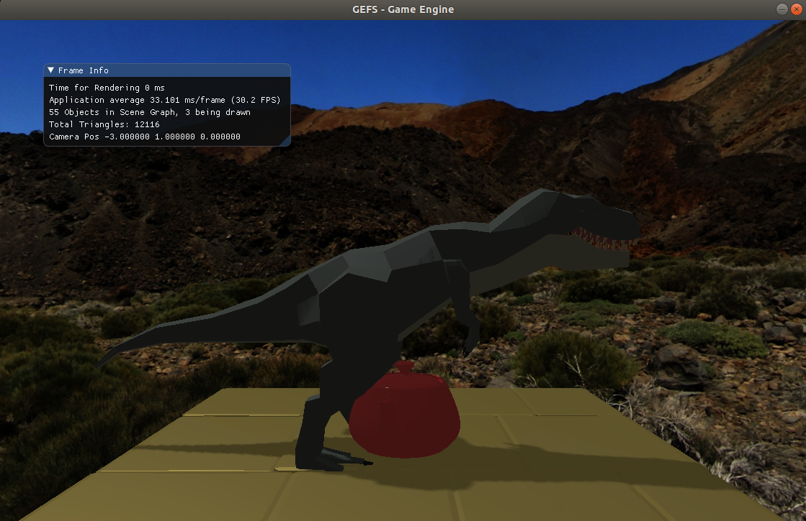
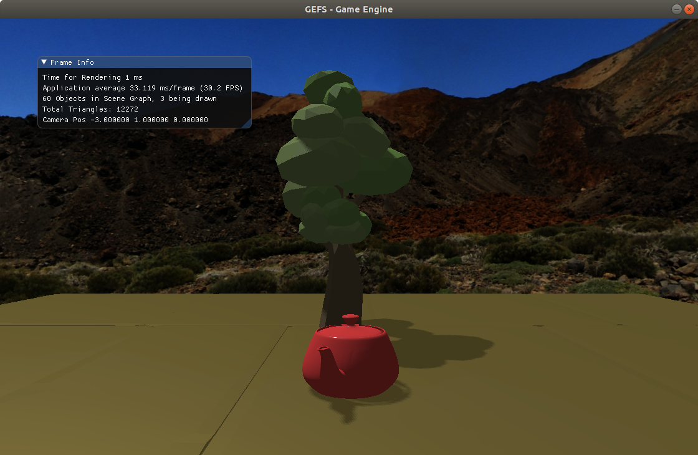
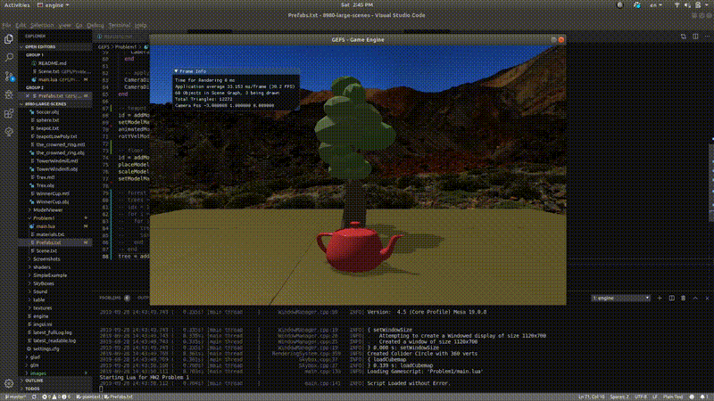
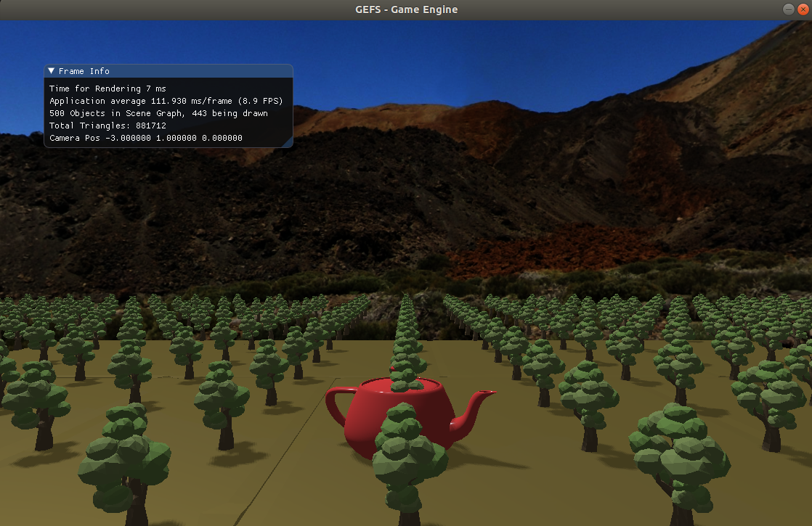

# CSCI 8980, HW 2 - Rendering Large Scenes
Nikki Kyllonen, [nkyllonen](https://github.com/nkyllonen)
Emily Moeller, [ecmoeller][https://github.com/ecmoeller]

## Building and Running Instructions
```
# build Makefile using cmake
$ cd build
$ cmake ..

# build engine
$ make -C <location of build/>

# to run a scene
$ cd GEFS
$ ./engine <folder containing main.lua> <optional config string>
```

Optional config strings are shown in `settings.cfg` as `[config string name]`. An option includes `[Debug]` which would then be run as follows:
```
$ ./engine <folder containing main.lua> Debug
```

## Final Submission Video
```
$ ./engine FrustumCulling/ Debug
```
[](https://drive.google.com/file/d/19XKEfIdugdSn76YNc4uFzIYXYOcTjahH/view?usp=sharing)

## Resources
Low poly tree obj package: [TurboSquid link](https://www.turbosquid.com/3d-models/blender-carrot-crystal-oak-tree-3d-model-1189852)

## Controls
- Arrow keys are scene dependent
    - If running SimpleExample/, these translate the trex model along the tiled floor.
    - If running a scene with the dynamic camera, such as Problem1/ or DebugCamera/ or FrustumCulling/, these rotate and translate the camera. See example video 1c for more information.
- R-key
    - Resets the scene by reloading the materials, models, and scene files. These do not include any changes made that require recompilation.
    - Note that this feature does not always work.
- D-key
    - Switches between viewing from the debug camera and viewing from the main camera. The debug camera position can be manually set in settings.cfg and used if a scene is initially launched in Debug mode (e.g. ./engine Problem1/ Debug).
- F-key
    - Switches between fullscreen viewing and window viewing.
    - Note that some screen recording programs will not record the fullscreen window that is displayed upon the screen.
- S-key
    - Will take a screenshot of the current window (without the text box displaying the fps and other measurements) and save it to a Screenshots folder within GEFS.

## Project Report
### Problem 1: Images and small captions
- 1a: This is a sample scene containing a simple trex model, a teapot model, and a small, tiled floor. Run as such: ./engine SimpleExample/



- 1b: This is a scene containing the same teapot model from above and an oak tree model which we downloaded from TurboSquid. See the resources section for a link to download the package.



- 1c: This video showcases our dynamic camera. By using the left/right arrow keys, you are able to rotate the camera to the left/right respectively. By using the up/down arrow keys, you are able to move the camera forward/backward respectively.

[](https://drive.google.com/file/d/1ZdrrtIgAiWb35ReJ9b_xjar0VDjuLQ5L/view?usp=sharing)

- 1d: This is our `Problem1` scene which contains 100 small oak tree models. As shown in the text box in the upper left hand corner, which so many triangles to render, the FPS dropped from 30 to single digits.



### Problem 2: Acceleration Techniques
_Describe what approaches you took to accelerating your slow scene from 1d. Include images documenting changes in visual quality with and without your acceleration code._

First, we did depth culling by only drawing objects that were within the near and far plane. Once that was working, we added frustum culling to only draw objects within our camera view. To implement frustum culling we first computed the eight planes by first calculating the eight vertices of the frustum in world coordinates, 4 for the near plane and 4 for the far plane. Next, we computed the normal vectors for each plane by doing the cross product of vectors on the plane, using the points computed from the previous step. All of this computation is done before the drawing loop that iterates through all the objects to draw, because the frustum will use the same values for each object. To see if the object is within the frustum, the dot product of the object’s location is computed with the normal vector of the plane. Finally, we are simply testing if the object to draw is located in the direction of the normal vector, for each of the eight planes that we calculated for the frustum. For depth culling, we did have time to incorporate the check to see if the radius of the object is still within the camera view, but we did not have time to finish the check when frustum culling was complete. 

_Additionally, try to answer the following questions:_
- Which of the things that you tried gave the biggest improvements?
    
    Frustum culling gave the biggest performance improvement.

- Which improved the least? Any hypotheses why?
    
    Depth culling gave the least performance improvement, because it did not eliminate drawing as many objects as frustum culling.

- What are the limitations or tradeoffs of the approaches you implemented? Are they always a win or are there some cases in which the performance can be worse or the rendering quality can degrade?
    
    Since we only had time for depth culling and frustum culling, we didn’t observe any limitations in our performance. One limitation of our current implementation is that we are not checking if the radius of the object is within the view of the camera, so a large part of the object is “popping” into frame after small movements of the camera. When considering the tradeoffs of rendering a complicated scene versus a simple scene, it may not be worth the additional computations to calculate the normal vectors of the frustum every single frame when there may be very few objects in the scene. Frustum culling becomes important only when the scene is complicated enough that the FPS is dramatically affected without it. 

### Debug Camera
- What is it? What is its use? How have we used it?

    A debug camera is a separate camera placed in your scene which is not used for any acceleration calculations such as depth culling and frustum culling, which we discussed above. This camera allows the programmer to view the effects of their accelerations from a different perspective. In this project, we used it to verify that our frustum culling was indeed not rendering objects placed outside of the frustum.
    
    A feature of the debug camera which we were unable to implement would be rendering the frustum itself. By rendering 3D lines outlining the main camera’s frustum, the programmer can more easily verify whether or not their techniques are working correctly.

- How did we implement this? How do you use it in this program?

    In our program, the debug camera is launched in debug mode. As mentioned in the controls section, debug mode is started by running ./engine <scene folder> Debug. Refer back to the controls section above to learn about using it while the program is running.

    The debug camera was implemented by adding another state to the system and an additional 4 camera globals, shown below. When the program is in debug state, the debug camera position is set to the position specified in the settings.cfg, and its direction and up vectors are set the same as the main camera’s values. The look-at-point, however is set differently. In order to always be able to see the effects of the acceleration techniques relative to the main camera, the debug camera’s look-at-point is always in the direction of the main camera. Therefore, when in a scene with a dynamic main camera, moving the main camera forward and backward will tilt the debug camera up and down.
    
    By default, the debug and main camera are the same and the debug values are used to construct the viewing matrix, shown below. When in debug mode, however, the debug camera’s values are set to their own values and those new ones are then used to create a different view matrix.