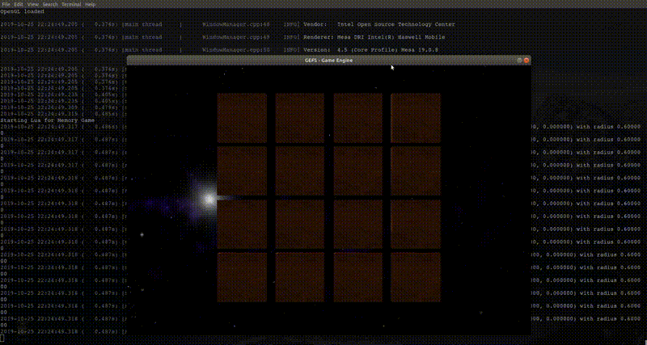

# 8980-scripted-game
CSCI 8980 - Real-time Game Engine Design, Assignment 3
- Nikki Kyllonen, [nkyllonen](https://github.com/nkyllonen)

- Emily Moeller, [ecmoeller](https://github.com/ecmoeller)

## Building and Running Instructions
```
# build Makefile using cmake (need to do this for every additional C++ files added)
$ cmake ..

# build engine
$ cd GEFS
$ make -C <location of build/>

# to run a scene
$ cd GEFS
$ ./engine <folder containing main.lua> <optional config string>
```

Optional config strings are shown in `settings.cfg` as `[config string name]`. An option includes `[Debug]` which would then be run as follows:
```
$ ./engine <folder containing main.lua> Debug
```

## Resources
- Low poly tree obj package: [TurboSquid link](https://www.turbosquid.com/3d-models/blender-carrot-crystal-oak-tree-3d-model-1189852)

- Pirate Kit (1.1): Created/distributed by Kenney [(www.kenney.nl)](www.kenney.nl)

- Farm Animals Pack by Quaternius [https://www.patreon.com/quaternius](https://www.patreon.com/quaternius)

- Pirate Pack

- Potion Pack

- Farm Animals Pack by Quaternius [https://www.patreon.com/quaternius](https://www.patreon.com/quaternius)

- Nebula Skybox: Created by 'amethyst7' aka Chris Matz. WEB site: [http://amethyst7.gotdoofed.com](http://amethyst7.gotdoofed.com)

## Controls
- Arrow keys are scene dependent
    - If running SimpleExample/, these translate the trex model along the tiled floor.
    - If running a scene with the dynamic camera, such as Problem1/ or DebugCamera/ or FrustumCulling/, these rotate and translate the camera. See example video 1c for more information.
- R-key
    - Resets the scene by reloading the materials, models, and scene files. These do not include any changes made that require recompilation.
    - Note that this feature does not always work.
- D-key
    - Switches between viewing from the debug camera and viewing from the main camera. The debug camera position can be manually set in settings.cfg and used if a scene is initially launched in Debug mode (e.g. ./engine Problem1/ Debug).
- F-key
    - Switches between fullscreen viewing and window viewing.
    - Note that some screen recording programs will not record the fullscreen window that is displayed upon the screen.
- S-key
    - Will take a screenshot of the current window (without the text box displaying the fps and other measurements) and save it to a Screenshots folder within GEFS.

## Project Report

### Animation Highlights

_show a targeted video highlighting the use of animation. Explain why you chose these specific animation aspects for your puzzle/game (from a design perspective) and describe how you achieved these animation effects (from a technical perspective)_

#### Rotating tiles by clicking

[](https://drive.google.com/file/d/1VmDnugBzUmzohaOUJID3_5jrK3Es1-q2/view?usp=sharing)

1. From a design perspective, why did we choose a click-based rotation?

    A click-based rotation is the closest to how you would naturally play this game with cards on a table. In a physical card matching game, you would pick up and flip cards manually. By allowing the player to click on which tile they would like to turn and then animating that "flip" as a quick rotation, we can most closely emulate the action of flipping up a card.

2. From a technical perspective, how did we implement a click-based rotation?

    The rotation is done by keeping track of the amounts that each tile is currently rotated. These values are stored as radian values within the `flipped` array:
    
     ```
        0 : this tile is not rotating at all (therefore must be either flipped up or down)
        < 0 : this tile is in the middle of flipping down
        > 0 : this tile is in the middle of flipping up
    ```
    
    Each frame, these values are monitored and the tiles with non-zero values are further rotated in their respective directions by calling `rotateModel` and updating their radian value within `flipped`.

    The clicking is done by creating a layer of colliders on top of each tile. These colliders are placed when the board is originally generated and are monitored within our `mouseHandler` which is called whenever a mouse event occurs. If a left click has been registered, `mouseHandler` calls `getMouseClickWithLayer` to determine the collider which was clicked and to return the id of the model corresponding to that collider.
    
    With this model id, if it is a valid time to rotate a tile (no tiles are flipped or only one other tile is flipped), then that model's radian value within `flipped` is set to a very small positive number. This small positive number will, in essence, notify `frameUpdate` that this tile is now in the process of flipping up.

#### Some disappearing card animation here

<!-- [](google drive link...) -->

1. From a design perspective, why did we choose a _____?


2. From a technical perspective, how did we implement a _____?

### Memory Game Preview

_~2 page report that explains your overall game from both a design and technical perspective. From the design side, consider the following questions as a starting point:_

1. Why did you choose the game?
2. What is the win condition?
3. How faithful is your implementation to physical/commercial versions of the game?
4. What are areas of the biggest differences?
5. What elements make playing your version better/worse than a physical experience?

### Using GEFS to build the game

1. How did you manage the complexity of how elements relate to each other while using a scripting language?
2. If you used GEFS, what code did you need to add on the C++ side to better support your game/scripting?
3. What were the hardest parts of the assignment from a technical perspective?
4. From a technical implementation perspective, how would you extend your final submission if you had 2-3 more weeks to work on it?